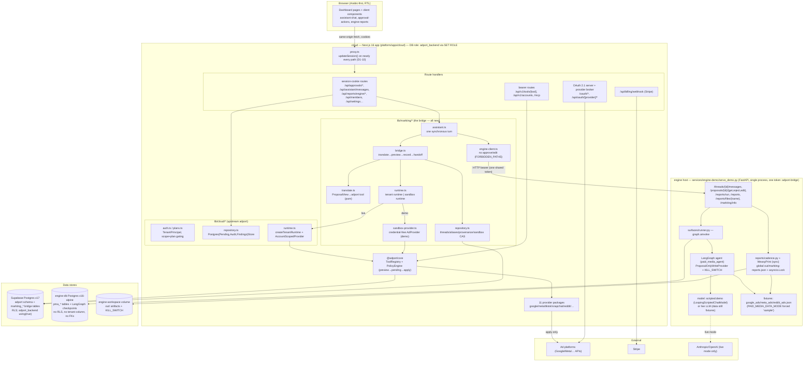
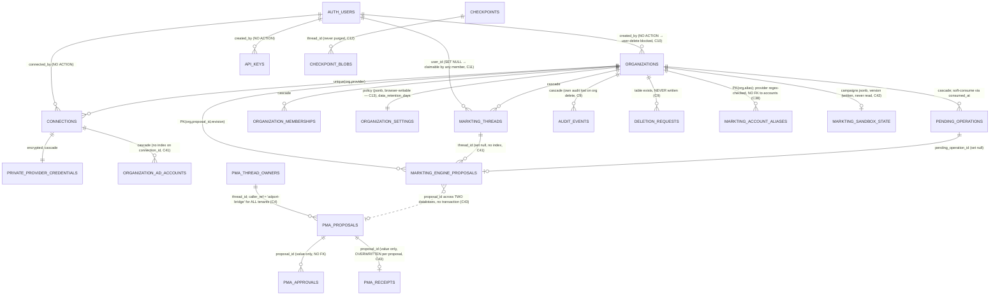
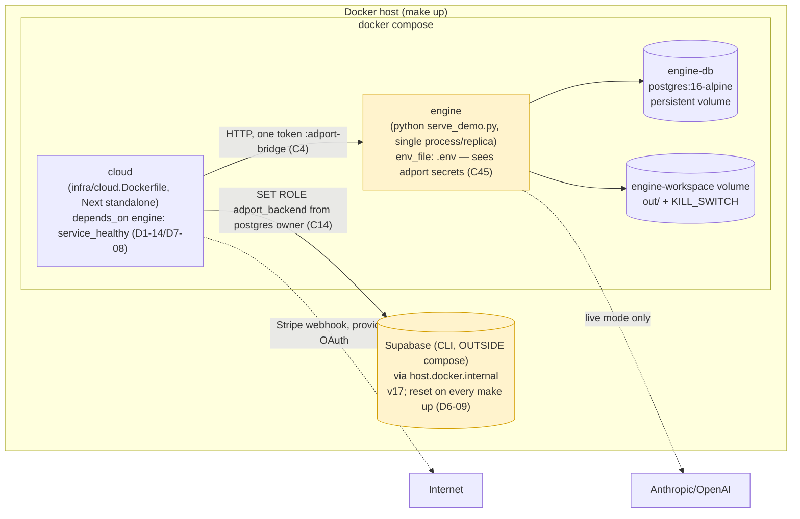
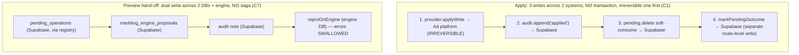

# 04 — System Architecture Map

Author: D11 (principal software architect). Date: 2026-10-03. Repository: `/home/user/markting-ai`.
Spot-checked against `git rev-parse HEAD` = `41b069e` (the D0–D10 reports cite earlier SHAs — `49817c5`, `f80877c`, `11784fd` — because the tree advanced during the parallel audit; every citation reproduced below still holds at HEAD).

This document synthesises the eleven subsystem reports (D0 cartographer, D1 Next.js, D2 TypeScript, D3 Python, D4 API, D5 database, D6 Supabase, D7 distributed systems, D8 multi-tenancy, D9 event-driven, D10 integration). Every claim carries a `path:line` citation (relative to the repo root) or names the agent finding that established it, plus a classification tag: VERIFIED_CODE, VERIFIED_TEST, VERIFIED_RUNTIME, DOCUMENTED_ONLY, INFERRED, NOT_VERIFIED. Fifteen citations were independently re-verified (see `agents/D11.md`); all held.

The product is an Arabic-first "AI media buyer" SaaS assembled from two vendored Apache-2.0 projects — **adport** (`platform/`, a Next.js cloud app + policy-gated ad-tool packages) and **paid-media-agent** (`engine/`, a LangGraph agent) — joined by glue in `platform/apps/cloud/lib/markting/*`, the engine host `services/engine-demo/serve_demo.py`, the bridge migration `platform/supabase/migrations/20261002000000_markting_bridge.sql`, and `infra/`. `engine/` is unmodified since import (`git diff 4162146 HEAD -- engine/` empty, VERIFIED_CODE, D0/D10).

---

## 1. Component map



Notes on the map (all VERIFIED_CODE unless tagged):
- The cloud app reaches the engine **only** through `engine-client.ts`, which structurally cannot call `/approve` or `/edit` (`engine-client.ts:61,77-79`, D7/D8/D10). The sole write path to a real ad platform is adport's `PolicyEngine.apply` (`platform/packages/core/src/policy/engine.ts:87-124`); the engine's `ProposalOnlyWriteProvider.call_mutation` always raises (`serve_demo.py:69-81`).
- `/mcp` and `/api/v1/*` use the **tenant** runtime (`createTenantRuntime`), never the bridge/sandbox runtime (`lib/markting/runtime.ts:16,19`, D0-10).
- The engine never reads tenant accounts in any mode: `assert_fail_closed` refuses to boot unless `paid_media_data_mode == 'sample'` and both the demo and the "live" branch coerce it to `sample` before that check even runs (`serve_demo.py:163-166,383-388`, VERIFIED_CODE, D0-01/D3-06/D10-01). "Live mode" is a real LLM over the three shipped fixtures.

---

## 2. Request flow: chat → proposal → preview → apply

```mermaid
sequenceDiagram
  autonumber
  actor U as User (browser)
  participant R as POST /api/assistant/messages (maxDuration=300, no-op on Node)
  participant A as runAssistantTurn (assistant.ts)
  participant Th as markting_threads (Supabase)
  participant E as Engine /threads/{id}/messages (one token :adport-bridge)
  participant G as LangGraph graph (ainvoke, no per-thread lock)
  participant B as bridgeProposal (bridge.ts)
  participant P as PolicyEngine.validate (core)
  participant PO as pending_operations + markting_engine_proposals (Supabase)
  participant AP as POST /api/approvals/[id]/apply
  participant PA as PolicyEngine.apply (core)
  participant Prov as AdProvider.applyWrite
  participant Ad as Ad platform

  U->>R: { text, threadId? }
  R->>A: sessionPrincipal(org) — note: route has NO tools:write check (D10-04)
  A->>Th: claimThread (false if owned by another user → 403)
  A->>E: sendMessage(text)  %% synchronous, up to 240s, no idempotency key (D7-05/D9-02)
  E->>G: graph.ainvoke  %% blocks; client abort does NOT cancel the graph (INFERRED, D9-02)
  G-->>E: latest_proposal (awaiting_approval) or text
  E-->>A: ProposalView
  alt proposal.state == 'awaiting_approval' (even if from a PRIOR turn — D9-03/D10-03)
    A->>B: bridgeProposal
    B->>B: registry.get(tool)  %% OUTSIDE try → UNKNOWN_TOOL dangles proposal (D1-03)
    B->>P: registry.call(tool, input)  %% preview, no pending_operation_id
    P->>PO: put pending_operations row (hash, expires_at = now+TTL)
    B->>PO: recordEngineProposal(status='pending')  %% overwrites prior pending_operation_id (D7-11)
    B->>E: rejectOnEngine(handoff)  %% best-effort; errors swallowed (D7-12/D9-03/D10-09)
  end
  Note over U,PA: Human review (different person by default), no notification, 15-min TTL (D7-09)
  U->>AP: approve (role + tools:write + requester≠approver; REST/MCP skip the last — D4-05)
  AP->>PA: applyPending  %% listPendingOperations(org,200).find(id) — false 404 past 200 (D4-10)
  PA->>PO: pending.get (NO atomic claim — D4-01/D5-01/D7-01/D9-01)
  PA->>Prov: applyWrite  %% a concurrent 2nd apply ALSO reaches here → double write
  Prov->>Ad: mutate (26 'create' tools are non-idempotent)
  PA->>PO: audit.append('applied') then pending.delete (soft, unconditional — no 'consumed_at is null' guard)
  AP->>PO: markPendingOutcome('applied')  %% 3rd non-transactional write; 'expired' never written (D0-05/C29)
```

The critical property the product sells — "approved once, applied once" (`README.md:79`) — is **not** guaranteed: `apply()` reads the pending row, calls the provider, then soft-consumes it, with no atomic claim and three non-transactional writes spanning two systems (`platform/packages/core/src/policy/engine.ts:88-124`; `platform/apps/cloud/lib/cloud/repository.ts` `delete` = unconditional `update … set consumed_at = now()`). D7 reproduced the double execution in-process (probe S1: `applyWrite calls = 2`; probe S2: a post-write audit failure leaves the row re-appliable). This is the single most important cross-cutting defect (consolidated **C1**, P1).

---

## 3. Data model (ER)



Two independent Postgres instances hold the system of record: **Supabase v17** (adport + `markting_*`) and **engine-db v16-alpine** (`pma_*` + LangGraph checkpoints) (`docker-compose.yml:43,67`, D5/D6). They are linked only by value (`proposal_id`) across a database boundary with no transaction and no FK (D5-13). `make up` runs `supabase db reset` every time (`Makefile`), so the two stores diverge after the first restart — engine rows reference org/user UUIDs that no longer exist in Supabase (D6-09). D5 applied all nine migrations to a scratch cluster and ran the bridge DB tests (4/4 pass, VERIFIED_RUNTIME) — the only agent to execute the Postgres paths.

---

## 4. Deployment topology



Single points of failure (highlighted): the **engine** is one process, one replica, one identity for all tenants, with in-process state (scripted model, report lock, report index on a single volume) that cannot be horizontally scaled (D7-07/D7-08/D8); and **Supabase** is reached out-of-band and wiped on every `make up`. No `.github/` CI exists at the repo root; no command runs the upstream engine suite (D0-08). Docker builds were blocked in the sandbox for every agent, so the container stack has **never been built or run end-to-end** (NOT_VERIFIED across D0–D10).

---

## 5. Duplicated responsibilities

| Responsibility | Duplicated across | Evidence | Risk |
|---|---|---|---|
| Pending-row location | `apply/route.ts:20`, `reject/route.ts:13` both `listPendingOperations(org,200).find(id)` though `PostgresPendingStore.get(id)` exists | D1-06/D2-08/D4-10/D5-09/D7-10/D8-10/D10-10 | false 404 past 200 rows; also the right spot for the atomic claim (C1) |
| `SandboxProvider` ≈ `SyntheticProvider` | `lib/markting/sandbox-provider.ts:85-186` is a near-line-for-line copy of `core/src/testing/synthetic-provider.ts:35-130` | D2-06 | drift between demo and the fixture it mirrors |
| `build_self_hosted_runtime` | `serve_demo.py:201-240` re-implements `engine/src/paid_media_agent/runtime/self_hosted.py:66-106` to inject the proposal-only provider; imports private `_postgres_checkpointer` | D0-06/D3-03/D10-07 | upstream refactor breaks boot with no compile-time signal (Python) and no CI |
| Response types re-declared client-side | `ReportRun`/`BridgeView`/`TurnResponse` in client components vs `EngineReportRun`/`AssistantTurn`/`BridgeResult` in `lib/markting` | D2-06 | server/client contract drifts silently (one drift already exists: `summary.platforms`) |
| Compare-and-set | sandbox (`markting/repository.ts:133-141`) and engine (`persistence/postgres.py:94-108`) both compare whole JSON docs; `version` columns unused | D5-07/D7-13 | payload bloat; false "version guard" |
| Four CHECK lists of provider ids + one regex | provider enum repeated in 4 tables; `markting_account_aliases.provider` only regex-checked | D2/D5-12/D6 | no single source of truth; aliases unconstrained |
| Retention cleanup | pg_cron `apply_data_retention` + an inline 1%-probability cleanup in `enforceRateLimit` | D9-08 | two mechanisms, neither covers `markting_*`/engine |

---

## 6. Accidental coupling & broken boundaries

1. **Host → upstream internals.** The engine host binds to ~10 private/test-only symbols of the vendored engine (`_postgres_checkpointer`, `resolve_caller`, `testing.demo_script`, `testing.scripted_model`, the frozen `SelfHostedRuntime` fields) while `UPSTREAM.md:67` claims "nothing in `engine/` is modified" — true for tracked files, but the coupling is as tight as a patch and has no drift check (D0-06/D3-03/D10-07, **C27**). Running the host from source also writes `engine/workspace/KILL_SWITCH` into the vendored tree, flipping 19 upstream tests to failure (`serve_demo.py:173-180`, VERIFIED_RUNTIME D0-02/D3-05/D4-16, **C26**).
2. **Cloud ↔ engine identity.** All tenants share one engine token/caller (`docker-compose.yml:49`), so every engine-side ownership and visibility check is tautological; the entire conversation-isolation boundary lives in one place: the `org_<org>__u_<user>__…` thread-id format checked by `assistant.ts:34-38` + `claimThread` (**C4**, D8-02). One missed check or one leaked token exposes every tenant.
3. **Demo code on the production path.** `MARKTING_DEMO_MODE`/`MARKTING_ALLOW_SELF_APPROVAL` are process-global env flags defaulting to `true` in the shipped root `.env.example:47,49`; demo mode swaps the sandbox runtime for **every** org and writes `provider='sandbox'` rows beside real ones (**C22**, D0-04/D1-04/D6-04/D8-08/D10-15). Fails toward the sandbox, but self-approval in live mode removes four-eyes on real accounts.
4. **Two error worlds glued by string matching.** `AdportError` (8 codes) + `HttpError`/`PlanLimitError`/`BridgeAccessError`/`EngineError`, with authentication failures re-identified by message equality in six routes; one edit of the string turns 401s into 500s (D2-05/D4-06, **C19/C40**).
5. **Whole `.env` to both containers.** The engine sees adport encryption keys/pepper/Stripe secret; the cloud sees the model key (`docker-compose.yml:17,40`, **C45**, D10-11).

---

## 7. Cross-tenant risk register

| Risk | Severity (consolidated) | Today's exposure | Evidence |
|---|---|---|---|
| Engine report surface global: any org lists/downloads/triggers any run; `/markting/info` unauth; one global lock | **P2** today, **P0** if `assert_fail_closed` is ever relaxed | metadata (who/when/windows/summary) + shared fixture content + DoS; no real tenant data because data is forced to `sample` | `serve_demo.py:324-374`, `reports/engine/route.ts:16-24` (VERIFIED_CODE+RUNTIME); D1-01/D4-03/D8-01/D10-08 (**C3**) |
| Engine single identity → conversation isolation is a one-line convention | **P2** | structural only; no current cross-tenant path through the one caller | `docker-compose.yml:49`, `assistant.ts:34-38` (**C4**); D8-02 |
| Backend DB role has zero tenant isolation (`adport_backend … using(true)`); isolation is hand-written WHERE only | **P3** (defense-in-depth) | no breach found; every traced query is scoped | migration `:83-89`, `lib/db.ts:13` (**C24**); D6-03/D8-03 |
| 12 public tables keep Supabase default ALL grants for `anon`/`authenticated`; RLS does not cover TRUNCATE | **P3** | neutralised by RLS today; one forgotten `enable rls` on a future table = leak | D5-06 T3 (`truncate audit_events` succeeded as `authenticated`, VERIFIED_RUNTIME on stub); D6-10 (**C25**) |
| Assistant threads claimable by any org member after owner deleted (`user_id` set null) | **P2** (D5) / **P3** (D8) | same-tenant private-conversation disclosure | `markting/repository.ts:22-23`, migration `:14` (**C11**); D5-05 T7b/D8-05/D6-11 |
| `organization_settings.policy`/`data_retention_days` writable via PostgREST, bypassing plan cap/validation/audit | **P2** | within one's own tenant (plan-limit + audit evasion + self-DoS), not cross-tenant | migration `:277-289,332`; D6-01 (**C13**) |
| Routing a fixture-derived proposal to a real account via alias binding | **P1** (UNSAFE_TO_AUTOMATE) | possible by binding `demo-*` aliases to real accounts; only policy cap + human apply stand in the way | `translate.ts:133-142`, D0-01/D10-01 (**C2**) |

---

## 8. Scaling bottlenecks

- **Engine is unscalable as built**: one scripted-model instance with per-process mutable state (`serve_demo.py:84-115`, breaks on the 2nd conversation — **C5**/D3-01/D7-04/D10-02); one global `asyncio.Lock` serialising every tenant's report runs (`serve_demo.py:324` — head-of-line blocking, D8-06/D9-04); report index a single JSON file on one volume (D7-07); synchronous WeasyPrint render on the event loop (D9-04, VERIFIED_RUNTIME: a 50 ms sleep overshot by 1.36 s during one render); `max_size=4` pools (D7-08). Two replicas would race the index and 404 each other's files.
- **Chat is a single synchronous HTTP call held open for minutes** (`engine-client.ts` 240 s default, `assistant/messages/route.ts:7` `maxDuration=300` which is a no-op on the Node standalone server) with no queue, stream, idempotency key or cancellation (**C6**/D1-02/D7-05/D9-02). Behind any proxy/LB with a 60–120 s idle timeout this fails.
- **No per-thread serialisation** on either side; concurrent turns interleave checkpoints (**C8**/D7-06/D9-10).
- **Apply/reject O(n) scan** capped at 200 rows (**C31**), unbounded list endpoints and no pagination (C32/D4-10).
- **Retention is a single unbatched daily pg_cron delete** that can hold locks on a large tenant (D9-08).

---

## 9. Transaction boundaries & consistency problems



- **Apply has no atomic claim** and performs the irreversible provider write before any durable marker; a crash or audit failure between steps 1 and 3 leaves the row re-appliable (D7 probe S2). Concurrent applies both pass `get` and both execute (**C1**, P1). The engine already has the correct pattern (`pma_approvals` conditional `UPDATE … WHERE used_at IS NULL`, `persistence/postgres.py:177-184`); adport does not.
- **Dual-write with no saga state** between Supabase and the engine DB: the hand-off is best-effort and swallowed on failure (`bridge.ts:98-105`), unsupported proposals are never handed back, and a later unrelated turn re-bridges the stale `awaiting_approval` proposal → a second pending row + overwritten provenance (**C7**, D7-11/D7-12/D9-03/D10-03/D10-04).
- **Stripe webhook idempotency is check-then-act** outside the state transaction; concurrent deliveries double-process and out-of-order deliveries regress plan state (`billing.ts:120-136`, **C16**, D5-10/D9-06; upstream code).
- **Token rotation is inline in reads**; a persistence failure loses a rotated refresh token held only in a request-scoped object (**C17**, D9-07; upstream code).
- **Org deletion is four non-transactional statements** that cascade away the org's own audit trail, never write `deletion_requests`, and revoke only the Google token (**C9**, D5-02).

---

## 10. Queue / background-job requirements (all MISSING today)

Repo-wide search finds no outbox, queue, worker, scheduler, `BackgroundTasks`, `LISTEN/NOTIFY` (D9-11). `README.md:77` claims "scheduled reports" but `engine/schedules/*.py` are Managed-Deep-Agents declarations and `OPERATIONS.md:141-142` states they are not a self-hosted scheduler; the only report trigger is the dashboard button (D9-04/D9-11). Concretely needed (D9 design, consolidated):

1. **Append-only domain-event table + `SKIP LOCKED` worker** on the existing Supabase Postgres (atomic `state + event` via `db().begin`); `audit_events` becomes a projection. Missing events: `proposal.created`, `preview.expired`, `engine.handoff_failed`, `approval.apply_requested/applied/apply_failed`, `outcome.measured`, `report.run.*`, `credential.rotated` (D9-12, **G4**).
2. **Asynchronous chat turn**: route returns 202 + turn id; worker calls the engine with an idempotency key (the engine's `DedupeStore` already exists); UI polls/SSE (**C6**).
3. **Report jobs**: per-org `report_runs` rows, engine render off the event loop (`asyncio.to_thread`), org-scoped listing, per-org quota (**C3**).
4. **Expiry as an event**: pg_cron sweeper that marks `expired` (never written today — **C29**/D0-05), audits it, and notifies the approver (no notification path exists — D7-09).
5. **Retention + purge** extended to `markting_*`, MCP OAuth (purge defined but never scheduled), engine `pma_*`/checkpoints/`out/`, with a run log (**C12**/D5-04/D6-07/D9-08).
6. **Post-apply readback / outcome measurement** — nothing measures whether an applied change helped (D9-12, **G6**).

---

## 11. Migration risks

- **Engine schema has no migration mechanism** (`CREATE TABLE IF NOT EXISTS` only, no version ledger, no FKs, `pma_receipts` overwritten per proposal) — adding a column later needs a hand-written `ALTER`; cross-DB provenance orphans on a one-sided restore (**C43**/D5-13/D6-09).
- **Supabase migrations apply cleanly in order** (D5 ran all nine, VERIFIED_RUNTIME) but have **no default-privilege safety net** and only one `lock_timeout`; a hot-table `ALTER`/CHECK rewrite takes `ACCESS EXCLUSIVE` (D5-14).
- **Generated `database.types.ts` omits every `markting_*` table** (harmless today — supabase-js is auth-only — but a trap if PostgREST data access is ever added) and the test default port drifts (54322 vs 55322) (D5-12/D6-12).
- **`UPSTREAM.md` register is machine-uncheckable**: 44 upstream files modified, ~30 hidden under a catch-all sentence; the planned `check-upstream-edits.sh` does not exist (**C52**/D0-03/D10-12). A future upstream sync cannot mechanically tell which files to re-apply.
- **Production Supabase config is out of repo** (`config.toml` governs the local CLI stack only) — sign-up policy, confirmations, pooler mode, `postgres` BYPASSRLS, default privileges are all unknown (D6-13, NOT_VERIFIED).

---

## 12. What is genuinely sound (positive findings, to preserve)

- The **single-write-path invariant is structurally present and fail-closed**: engine `ProposalOnlyWriteProvider` + kill switch + zero approvers + `assert_fail_closed`; `EngineClient` has no approve/edit; demo/mock surfaces are config-gated and refused by the hosted connector (D0-10/D3/D10; VERIFIED_CODE+TEST).
- **Apply replays the stored post-parse payload through `registry.call`**, so zod re-validates and `PolicyEngine` re-hashes — a stored row cannot smuggle an unvalidated payload (D0-10/D2).
- **TypeScript surface is strong**: `strict` + `noUncheckedIndexedAccess`, zero `any` in first-party source, single zod instance, typecheck clean (D2; VERIFIED_RUNTIME).
- **Engine is `ruff`/`mypy --strict` clean**, all domain/config models frozen (D3; VERIFIED_RUNTIME).
- **adport tenant scoping is correct in every traced path**; single-use secrets (OAuth state, MCP codes, account selections) consume atomically under `for update`; engine proposal CAS + approval replay are single-use (D5-15/D8-11; VERIFIED_RUNTIME for the DB paths D5 ran).
- **Bridge tables' RLS/revoke is stricter than most upstream tables** (`using(false)` for `authenticated` + revoke from `anon`/`authenticated`) (D5/D6; VERIFIED_CODE).
- **Arabic-first i18n/RTL in the cloud UI** is complete (667 keys, 0 physical-direction CSS, parity test passes) — though engine reports remain English/LTR (D0/D1).

---

## 13. Disagreements between the D agents (reconciled)

| Topic | Divergence | Reconciliation |
|---|---|---|
| Double-apply severity | D4/D5/D7/D9 → **P1**; D1-06 → P2 ("upstream weakness, newly exposed") | **P1.** D7 reproduced it at runtime (probe S1/S2); 26 `create` tools make it non-idempotent. D1's "upstream" framing is about origin, not impact. |
| Engine reports severity | D1/D8 → **P1**; D4/D7/D10 → **P2**; D3 → P3 | **P2 today**, explicitly escalating to **P0** if `assert_fail_closed` is relaxed. Today's content is synthetic/identical; the real exposure is metadata + a shared-lock DoS. The disagreement is about future vs present data. |
| Thread-claim-after-delete severity | D5 → **P2**; D8 → **P3** | **P2.** It is same-tenant disclosure of private conversation content (D5 verified the null-then-claimable path at runtime, T7b); D8 rated it P3 only because the sole current caller adds a prefix check. |
| Stripe webhook severity | D9 → P2; D5 → P3 | **P3**, noting D9's P2 argument. It is unmodified upstream adport code; sequential replays are protected; the concurrent/ordering race is real but needs concurrent Stripe delivery. |
| Demo/self-approval flags | D1/D6 → P2; D0/D8/D10 → P3 | **P2.** Fails toward the sandbox (so not P1), but `MARKTING_ALLOW_SELF_APPROVAL=true` is independent of demo mode and removes four-eyes on real accounts in live mode. |
| DB-gated tests | D1/D2/D4/D6/D7/D8/D10 → NOT_VERIFIED (ECONNREFUSED); **D5 ran them** on a scratch cluster (4/4 pass) | **D5 is authoritative** for Postgres behaviour. Its runtime verification upgrades several findings (tenant scoping, CAS, migration apply) from VERIFIED_CODE to VERIFIED_RUNTIME. |

No agent contradicted another on a matter of fact; the divergences are all about severity calibration or about what each agent was able to execute. The eleven reports are mutually consistent and, where they overlap (the double-apply, the global reports surface, the fixture-only engine, the demo-model defect, the synchronous chat), they independently reached the same conclusion from different entry points — which materially raises confidence in those findings.

---

Confidence in this map: **0.85**. The component/flow/ER/topology structure, the duplicated responsibilities, the coupling and the cross-tenant register are VERIFIED_CODE (15 citations re-verified at HEAD, `agents/D11.md`). What remains NOT_VERIFIED everywhere: any container build or end-to-end `make up` run (Docker blocked for all agents), `MARKTING_ENGINE_MODE=live` with a real key, and production Supabase configuration.
