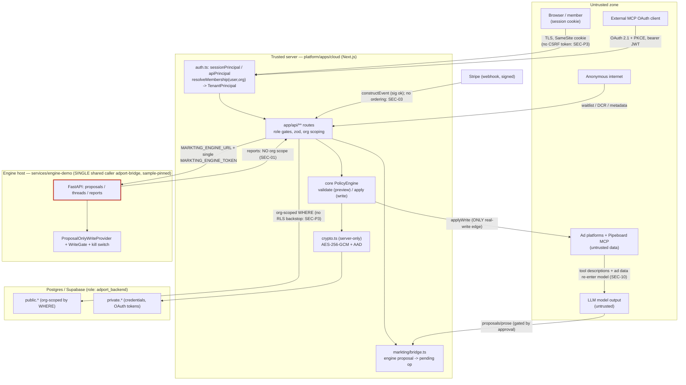

# 05 — Security Threat Model (markting-ai)

Author: E11 (security lead). Consolidates and resolves the findings of specialists E1–E10,
spot-checked against code. Every verdict carries a `path:line` citation (relative to repo root)
or a command + exit code, and a classification tag. Code is the source of truth; where specialists
disagreed on severity I resolved against the code and say so.

Scope of the system under review: an Arabic-first "AI media buyer" SaaS assembled from two vendored
Apache-2.0 projects — `platform/` (adport cloud + core policy/provider packages) and `engine/`
(paid-media-agent) — glued by `services/engine-demo` (the markting engine host), `infra/`, and the
`markting` modules in `platform/apps/cloud`.

---

## 1. Assets

| # | Asset | Where | Sensitivity |
|---|-------|-------|-------------|
| A1 | Provider OAuth credentials (ad-platform access/refresh tokens, client secrets) | `private.provider_credentials` (AES-256-GCM, AAD `connection:<org>:<provider>`) | Critical — spend money on real ad accounts |
| A2 | The ability to *execute a write* on an ad platform (budget/status change, campaign create) | `PolicyEngine.apply` → `provider.applyWrite` (`platform/packages/core/src/policy/engine.ts:113`) | Critical — direct financial effect |
| A3 | Pending operations (previewed, hash-locked, TTL'd writes awaiting approval) | `public.pending_operations` | High — each is an authorized-but-unexecuted spend |
| A4 | Tenant business data: campaign performance, spend, ROAS, report bodies/metadata | engine reports (`out/`), `markting_*` tables, findings | High — competitively sensitive |
| A5 | Auth material: Supabase sessions, API keys (HMAC-peppered), MCP OAuth access/refresh tokens | `private.*`, `public.api_keys` | High |
| A6 | Billing/entitlement state (plan → `maxActiveAccounts` → how many accounts may spend) | `public.organization_subscriptions` | High — governs spend ceiling |
| A7 | Encryption keys / pepper / signing keys | env (`ADPORT_CLOUD_ENCRYPTION_KEY`, `ADPORT_API_KEY_PEPPER`, `MARKTING_ENGINE_TOKEN`, Stripe/Slack secrets) | Critical |
| A8 | Audit trail (who approved/applied what) | `public.audit_events` | High — accountability/forensics |

## 2. Actors

| Actor | Trust | Capability |
|-------|-------|------------|
| Anonymous internet | Untrusted | Reach `/`, `/login`, `/api/waitlist`, OAuth metadata, DCR (`/oauth/register`), Stripe webhook |
| Workspace member (viewer/member/admin/owner) | Semi-trusted, tenant-scoped | Dashboard + API within own org; only owner/admin may apply writes |
| API-key holder | Semi-trusted, scope- & org-bound | `/api/v1/*` within scopes (`tools:read`/`tools:write`), plan-bounded |
| MCP OAuth client | Semi-trusted, user+org+resource-bound | MCP tools per scope; **no tenant-side revocation** (SEC-06) |
| The LLM / model output | **Untrusted** | Emits proposals and prose; cannot write without human approval (invariants 1–3 HOLD) |
| Pipeboard MCP backbone + ad-platform responses | **Untrusted data, trusted classification** | Supplies tool metadata (`readOnlyHint`) and ad data that re-enter the model (SEC-10, indirect injection) |
| Engine host (`adport-bridge`) | Trusted, **single shared caller** | One token for all orgs; proposal-only, kill-switched, sample-pinned |
| Stripe | Trusted (signature-verified) | Drives entitlement via webhook |
| Platform operator / superuser | Fully trusted | Seed scripts, DB owner, env |

## 3. Trust boundaries

**The dominant boundary fact:** tenant isolation is enforced almost entirely by application
`where organization_id = …` predicates plus `resolveMembership`; the database grants the server role
`using (true) with check (true)` and no `force row level security`
(`platform/supabase/migrations/20261002000000_markting_bridge.sql:83-86`, VERIFIED_CODE). The one
place where the application predicate is simply **absent** is the engine reports surface (SEC-01).

The write boundary (A2) is the system's strongest property: only
`platform/packages/core/src/policy/engine.ts:113` reaches a real provider's `applyWrite`
(`grep -rn applyWrite` over core/cloud, exit 0 — the only other hits are the sandbox provider and the
account-scope decorator that `PolicyEngine` itself calls), and the engine host replaces the write
provider with a proposal-only one behind a fail-closed boot.

---

## 4. The 15 invariants — verdicts

Spot-checked against code. HOLDS = enforced by code; PARTIAL = enforced on the main path but with a
gap; BROKEN = defeatable.

| # | Invariant | Verdict | Evidence (spot-checked) |
|---|-----------|---------|-------------------------|
| 1 | adport is the only writer to ad platforms | **HOLDS** | Only `platform/packages/core/src/policy/engine.ts:113` calls `provider.applyWrite`; engine host swaps in `ProposalOnlyWriteProvider` + kill switch + fail-closed boot (`services/engine-demo/serve_demo.py:160-170,382-388`). `grep -rn applyWrite` confirms no other real-write edge. VERIFIED_CODE + VERIFIED_TEST (E10 `test_demo_api.py` 7/7, `policy-engine.test.ts`). |
| 2 | engine cannot bypass adport | **HOLDS** | `EngineClient` has no approve/edit method and `FORBIDDEN_PATHS` rejects `/approve`,`/edit` (`platform/apps/cloud/lib/markting/engine-client.ts:61,77-79`). VERIFIED_CODE. |
| 3 | every write requires a preview first | **HOLDS** | `bridge.ts:76` calls `registry.call` **without** `pending_operation_id` (→ `PolicyEngine.validate`, preview only); the write second-call adds `pending_operation_id` (`bridge.ts:120`), reachable only from the apply route. VERIFIED_CODE. |
| 4 | preview and apply cannot materially differ | **PARTIAL** | Op hash locks inputs (`engine.ts:104-109`), so the *target* value applied equals what was reviewed; but `apply` returns the **stored** preview with no post-apply reconciliation, so a `fromMicros`/delta shown to the approver can be stale (SEC-17 / E10-04). VERIFIED_CODE. |
| 5 | policy checks cannot be bypassed at apply | **PARTIAL** | `apply` re-runs only `checkStaticPolicy` (protected accounts); `checkBudgetPolicy` runs only at validate (`engine.ts:110-153`). A pending op validated under looser rails applies after rails tighten, up to TTL (SEC-07). VERIFIED_CODE. The inline comment "Policy may have changed … re-check" overstates it. |
| 6 | tenant isolation is complete | **PARTIAL** | All Postgres-backed surfaces are org-scoped and unbreakable in my reading (pending/threads/findings/sandbox/keys/tokens/members/settings/connections); the **engine reports** surface has no org dimension at all (SEC-01). VERIFIED_CODE. |
| 7 | engine conversation isolation is safe | **HOLDS (single-point)** | Cloud namespaces thread ids `org_<org>__u_<user>__…` + regex gate + `claimThread` DB ownership (`platform/apps/cloud/lib/markting/assistant.ts:34-38`). The engine's own ownership check is a no-op across tenants (one shared caller) but unreachable because the cloud gates the id. VERIFIED_CODE. |
| 8 | provider tokens encrypted correctly | **HOLDS** | AES-256-GCM, 32-byte key assertion, random 12-byte IV, auth tag, AAD = `connection:<org>:<provider>` (`platform/apps/cloud/lib/crypto.ts:5-27`). Cross-org decrypt fails (VERIFIED_TEST `crypto.test.ts`). |
| 9 | no provider credentials reach the browser | **HOLDS** | `crypto.ts`/`repository.ts` are `server-only`; only `NEXT_PUBLIC_SUPABASE_*` are public (E3). No route returns ciphertext/refresh tokens. VERIFIED_CODE. |
| 10 | correct currency/budget units per provider | **HOLDS (spot-checked 4/11)** | google micros, meta cents→micros ×10⁴, tiktok units→micros + rejects untyped budget, snapchat micro fields (E10). apple/microsoft/reddit/spotify/pinterest/linkedin/x NOT_VERIFIED in depth. |
| 11 | approval TTL enforced | **HOLDS** | Route filters `expires_at > now()`; `engine.apply` re-checks expiry and deletes expired before any write (`engine.ts:97-103`). VERIFIED_CODE + VERIFIED_TEST. |
| 12 | duplicate / replayed approval impossible | **BROKEN (concurrent)** | Sequential replay blocked (VERIFIED_TEST `policy-engine.test.ts`), but `PostgresPendingStore.get` has no `for update`, `delete` sets `consumed_at` **without** `and consumed_at is null`, and apply is get→applyWrite→audit→delete with no transaction (`platform/apps/cloud/lib/cloud/repository.ts:386-418`, `engine.ts:87-125`). Two parallel applies both execute (SEC-02). VERIFIED_CODE. |
| 13 | audit cannot silently omit writes | **PARTIAL** | Order is `applyWrite` → `audit.append('applied')` → `delete` with no pre-write intent row (`engine.ts:113-123`); if the audit insert throws after the platform write, the write exists with no `applied` row and the un-consumed pending enables a retry (SEC-08). VERIFIED_CODE. |
| 14 | demo mode cannot affect production accounts | **HOLDS** | Demo/live is a deployment-global env flag; demo uses `SandboxProvider`, real providers never instantiated; engine host refuses to boot unless `data_mode == sample` (`serve_demo.py:160-170`). VERIFIED_CODE + VERIFIED_TEST. |
| 15 | MARKTING_ENGINE_TOKEN cannot create cross-tenant access | **PARTIAL** | Through the cloud routes the token never yields cross-tenant *adport* data (sessions + org-scoped thread ids). But it is a single shared secret fronting a non-partitioned engine, and the reports route already returns every tenant's runs (SEC-01); a leaked token grants full engine-data access. VERIFIED_CODE. |

Summary: **9 HOLD, 5 PARTIAL, 1 BROKEN.** The BROKEN one (replay) and the two financially-loaded
PARTIALs (budget re-check #5, reports isolation #6) are the headline risks.

---

## 5. Findings (consolidated, deduplicated, final severities)

Severity rubric (from the audit charter): **P0** security/data-loss/cross-tenant/unsafe ad execution
**present today**; **P1** production blocker or serious financial risk; **P2** substantial
functional/reliability deficiency; **P3** quality/hardening. No present-day P0 survived verification
(the cross-tenant IDOR is bounded to synthetic data today — see SEC-01 — so it is P1/latent-P0, not a
live P0). I did not inflate.

### P1 — production blockers / serious financial or security risk

| ID | Finding | Specialists | Evidence | Why this severity |
|----|---------|-------------|----------|-------------------|
| **SEC-01** | **Engine reports surface has no tenant isolation** (cross-tenant IDOR). `GET /api/reports/engine` and `/api/reports/engine/{name}` authenticate a session but never scope by org; the engine serves one global index + `out/` dir under one shared token. | E1-01, E4-01, E5-01, E10-02 | `platform/apps/cloud/app/api/reports/engine/route.ts:17-20`, `.../[name]/route.ts:11-15`, `platform/apps/cloud/lib/markting/engine-client.ts:131,134-137`, `services/engine-demo/serve_demo.py:355-374`, `docker-compose.yml:22,41,49` | **P1, latent-P0.** The defect is in *production route code* that carries zero org scoping, and the product is sold as multi-tenant SaaS over real ad data. Today the only `/reports` host is `serve_demo.py`, boot-pinned to synthetic `sample` data (`serve_demo.py:160-170`), so what actually crosses tenants is run metadata (who/when/how many) + identical fixtures + a global 50-entry cap that evicts other orgs' history. It becomes a true P0 the instant any real-data report host is wired to the same unscoped routes — which nothing in code prevents. Resolves E1/E5 (P1) vs E4/E10 (P2-today): P1 is correct because severity attaches to the un-isolated route, not the demo pin. |
| **SEC-02** | **Pending-operation apply is not atomic → concurrent double-apply to ad platforms.** No `for update`; `delete` lacks `and consumed_at is null`; get→applyWrite→audit→delete runs outside a transaction. Two parallel `POST /approvals/{id}/apply` both execute a real write. | E10-01 (Invariant 12 BROKEN) | `platform/apps/cloud/lib/cloud/repository.ts:386-418`, `platform/packages/core/src/policy/engine.ts:87-125`; contrast the correct OAuth consume at `repository.ts:81-104` | **P1.** Unsafe/duplicated ad execution with direct financial effect (budget applied twice, campaign created twice). Only sequential replay is tested; no concurrency guard exists. The sibling OAuth path shows the team knows the correct pattern, which it did not apply here. |
| **SEC-03** | **Stripe subscription events applied with no ordering/version guard.** `applySubscription` writes plan/status straight from `event.data.object`; dispatch is on type only; schema stores no `created`/version. An out-of-order `updated(active)` after `deleted(canceled)` reactivates a paid plan and re-enables ad accounts. | E8-01 | `platform/apps/cloud/lib/cloud/billing.ts:57-138`, `platform/supabase/migrations/20260828120000_cloud_plans_and_account_scope.sql:51-55` | **P1.** Entitlement/financial drift. Active plan governs `maxActiveAccounts`, i.e. how many accounts may spend — a canceled org can be left able to spend. Stripe explicitly does not guarantee delivery order, so this is reachable in normal operation, not just under attack. |
| **SEC-04** | **Production Next.js 16.3.1 ships with 3 critical RCE advisories** (AVIF image-optimization RCE, `next/og` ImageResponse RCE are platform-independent; Windows RCE N/A on Linux image). | E9-01 | `platform/apps/cloud/package.json:33`; `pnpm audit --prod` → exit 1 (GHSA-2xp9-vwfh-vxw4, GHSA-vcvr-r3jv-pc5j, GHSA-p293-qw3h-jr36); patched ≥16.3.6 | **P1, borderline P0.** Internet-facing surface on a release with known critical RCE. Escalates to P0 if image-optimization or `next/og` is reachable from any route (not confirmed in this workstream). VERIFIED_RUNTIME (audit executed). |
| **SEC-05** | **No supply-chain/secret/CI gate runs on the shipped repo.** The monorepo has no root `.github`; Actions, Dependabot and Gitleaks live only under `platform/.github` and `engine/.github`, which GitHub discovers only from repo root. | E9-02 | `find . -maxdepth 3 -name .git` → only `./.git`; no `/.github`; `platform/.github/workflows/ci.yml`, `engine/.github/workflows/ci.yml:38-63` | **P1.** Nothing would have caught SEC-04 or any future vulnerable dep/leaked secret/regression. INFERRED on non-execution (the hosting repo *might* add a root `.github` not in this checkout) — confirm with the deploy repo. |
| **SEC-06** | **No resource-owner/admin revocation of MCP OAuth grants; grants also survive member deprovisioning.** The only revoke path (`/oauth/revoke`) requires the client's own token; removing a member does not revoke their `mcp_oauth_*` tokens and token auth never re-checks membership. Access 1h, refresh 30d. | E2-01 (P1) + E1-02 (P2) | `platform/apps/cloud/app/oauth/revoke/route.ts:15` (only revoke caller), `platform/apps/cloud/lib/cloud/mcp-oauth-repository.ts:263-298` (no membership join), `platform/apps/cloud/lib/cloud/tenant-admin.ts:117` (remove has no token revoke) | **P1.** An MCP client can spend ad budget for up to 30 days of continued refresh with **no tenant-side kill switch**, and a deprovisioned member keeps working credentials. The blast radius (budget spend) plus the absent containment control pushes the merged grant-lifecycle gap to P1, above the individual P2 that E1 gave the deprovisioning half alone. |

### P2 — substantial deficiencies

| ID | Finding | Specialists | Evidence | Note |
|----|---------|-------------|----------|------|
| **SEC-07** | **Budget caps (`max_budget_delta_pct`, `max_daily_budget_micros`) are not re-checked at apply** — only `checkStaticPolicy` runs; `checkBudgetPolicy` is validate-only. A pending op validated under looser rails applies after they tighten (window = TTL, default 15 min). | E10-03 (Invariant 5 PARTIAL) | `platform/packages/core/src/policy/engine.ts:110-153` | Financial guardrail-bypass window. VERIFIED_CODE. |
| **SEC-08** | **A completed real write can have no audit record** if `audit.append` throws after `applyWrite`; because `delete` is never reached the pending stays applicable (compounds SEC-02). No pre-write intent row. | E10-05 (Invariant 13 PARTIAL) | `platform/packages/core/src/policy/engine.ts:113-123` | Accountability + duplicate-write risk. VERIFIED_CODE. |
| **SEC-09** | **Engine `/proposals/{id}/reject` and `/edit` perform no caller/ownership authz** — `get_proposal` checks `requester_ref/approver_refs`; `reject`/`edit` do not; `runner.reject/edit` only check state. A valid engine bearer can rewrite or reject any proposal by UUID. | E5-02 | `engine/src/paid_media_agent/surfaces/api/app.py:104-150`, `engine/src/paid_media_agent/surfaces/runner.py:257-287` | Mitigated **in the markting product** (single `adport-bridge` caller + `FORBIDDEN_PATHS` block `/edit`,`/approve`). P1 in any multi-token engine deployment or if the shared token leaks. VERIFIED_CODE. |
| **SEC-10** | **Provider-supplied `readOnlyHint` is the sole trust anchor for read/write classification** in the engine catalog. A mutating tool mislabeled `readOnlyHint=true` (name evading the `mutate\|raw\|delete\|…` deny patterns) is admitted as a model-callable READ with no proposal/approval/WriteGate. | E6-03 | `engine/src/paid_media_agent/tools/catalog.py:175-190` | The deepest single trust assumption in the design; contingent on Pipeboard being compromised/buggy. INFERRED (requires provider compromise). |
| **SEC-11** | **Direct-adapter (X Ads, OpenAI Ads) and model-provider API keys are omitted from the engine redaction list**, so a raw token echoed standalone in an upstream error body/stack can reach the model, Slack and logs unredacted. | E3-01 | `engine/src/paid_media_agent/assembly.py:293-305` (`_secret_values` lists only 7 secrets; no `*_ads_*`/model keys); `runtime/profiles.py:54` `extra_secrets` defaults `()` and is never set | Possible live ad-platform credential leakage into untrusted sinks. VERIFIED_CODE (static reachability, not an observed leak). |
| **SEC-12** | **High/moderate transitive vulns reach the cloud app and MCP server** — `sharp`<0.35.4 (via next), `fast-uri`/`ip-address`/`qs` (via `@modelcontextprotocol/sdk`→express/ajv), `hono`<4.13.7 XSS. 6 high + 11 moderate. | E9-04 | `pnpm audit --prod` → exit 1; `platform/apps/cloud/package.json:29` (`@modelcontextprotocol/sdk ^1.30.0`) | VERIFIED_RUNTIME. Pair with SEC-13/SEC-05. |
| **SEC-13** | **No dependency-vulnerability scanning in any workflow** (no pnpm audit / pip-audit / OSV / Trivy). Even if CI ran (it does not, SEC-05) nothing would flag SEC-04/SEC-12. | E9-03 | `grep -rniE 'audit\|pip-audit\|trivy\|snyk\|osv' platform/.github engine/.github` → only an app-feature `audit run` | VERIFIED_CODE. |
| **SEC-14** | **MCP refresh-token rotation has no reuse detection / family revocation, and revocation does not cascade** between access and refresh tokens. Stolen refresh token used before the legitimate client rotates yields a fresh valid pair; revoking one leaves the sibling live. | E2-02, E2-03 | `platform/apps/cloud/lib/cloud/mcp-oauth-repository.ts:239-255,300-317` | RFC 9700 §4.14.2 / RFC 7009 §2.1 expectations unmet. VERIFIED_CODE. |

### P3 — hardening / quality (grouped; each sub-item individually evidenced)

| ID | Finding | Specialists | Evidence |
|----|---------|-------------|----------|
| **SEC-15** | **Web security headers weak:** production CSP keeps `script-src 'self' 'unsafe-inline'` (no XSS backstop) and no HSTS header. No injection sink exists today (React auto-escapes; no `dangerouslySetInnerHTML` — grep exit 1), so defense-in-depth only. | E1-03, E1-05, E6-09 | `platform/apps/cloud/next.config.ts:17,36-64` |
| **SEC-16** | **No CSRF token on cookie-authenticated state-changing routes** (JSON API routes) or the OAuth **consent** POST — both rely on Supabase SameSite=Lax (not pinned in code). Server actions are covered by Next; waitlist has an Origin allowlist these do not. | E1-06, E2-04 | `platform/apps/cloud/app/api/settings/route.ts` et al; `platform/apps/cloud/app/oauth/authorize/consent/route.ts:5-24`; `platform/apps/cloud/lib/supabase/server.ts:10-21` |
| **SEC-17** | **Preview shown to approver can be stale** vs the applied effect (target is hash-locked, but `from→to`/% reflect validate-time account state, no reconciliation). | E10-04 (Invariant 4 PARTIAL) | `platform/packages/core/src/policy/engine.ts:113,124` |
| **SEC-18** | **No DB-level per-tenant RLS; isolation = application WHERE clauses only.** Backend role has `using(true) with check(true)`, no `force row level security`; posture also silently depends on the runtime logging in as the non-owner `adport_backend`; `private.*` RLS enablement is inconsistent (credentials/OAuth tables rely on grants alone). | E4-03, E7-01, E7-02, E7-03 | `platform/supabase/migrations/20261002000000_markting_bridge.sql:83-86`; `20260817171039_cloud_initial_schema.sql:73-182,319-327`; `platform/apps/cloud/lib/db.ts:8-14` |
| **SEC-19** | **Engine has no tenant concept** — all threads/proposals/reports share one `caller_ref` (`adport-bridge`); isolation is pushed entirely to the cloud. Any future route forwarding a user-controlled `thread_id`/`proposal_id` without the cloud prefix/ownership gate is a cross-tenant read. | E4-02 | `engine/src/paid_media_agent/surfaces/api/app.py:91-153`; `docker-compose.yml:49` |
| **SEC-20** | **Platform read/write scope rests on a trusted `readOnly` boolean**; passthrough `*_api_read` tools accept `POST`+arbitrary path and are safe only because each provider re-validates against a read allowlist (verified apple/microsoft/reddit). No central invariant enforces this. | E5-03 | `platform/apps/cloud/lib/cloud/auth.ts:46-48`, `platform/packages/core/src/tools/registry.ts:84-89`, provider allowlists |
| **SEC-21** | **Provider text enters the model's instruction zone:** Pipeboard tool descriptions are injected verbatim into the tool list, and read payloads/entity names flow back to the model — classic indirect prompt-injection carriers (bounded: worst case is a human-approved proposal). | E6-04, E6-05 | `engine/src/paid_media_agent/tools/reads.py:369-378` |
| **SEC-22** | **Report HTML (model-written) served from the app origin** as an attachment with `nosniff` but **no `sandbox`/`default-src 'none'` CSP** of its own; relies on the attachment disposition if a client renders inline. | E6-08 | `platform/apps/cloud/app/api/reports/engine/[name]/route.ts:17-24` |
| **SEC-23** | **Error leakage:** several routes force 403 and return the raw `error.message` without logging (forced status < 500 bypasses the 500-mask); engine error detail (≤300 chars) is passed through to dashboard users. | E1-04, E5-04 | `platform/apps/cloud/lib/http.ts:24-32`; `platform/apps/cloud/lib/markting/engine-client.ts:112-116` |
| **SEC-24** | **Stripe dedup is non-atomic (TOCTOU)** — SELECT, then process, then INSERT-on-conflict as three separate `db()` calls; concurrent re-delivery double-processes (duplicate audit rows, redundant account scan). | E8-02 | `platform/apps/cloud/lib/cloud/billing.ts:120-137` |
| **SEC-25** | **Authenticated support endpoint has no rate limit** (each POST sends email); honeypot returns 400 (signals rejection) instead of success-shaped. | E8-03 | `platform/apps/cloud/app/api/support/route.ts:16-41` |
| **SEC-26** | **Null `created_by` silently disables the four-eyes self-approval guard** for API-key- and engine-created pendings; and apply/reject `.find` within only the 200 most-recent pendings (older valid op → 404). | E10-06, E10-07 | `platform/apps/cloud/app/api/approvals/[id]/apply/route.ts:20,22` |
| **SEC-27** | **Encryption-key rotation is impossible** despite a `key_version` column (single key, no keyring/key-id envelope; same for the API-key pepper); and the env check accepts any ≥40-char string while crypto requires exactly 32 decoded bytes (late failure). | E3-02, E3-03 | `platform/apps/cloud/lib/crypto.ts:5-37`, `platform/apps/cloud/lib/cloud/repository.ts:162`, `platform/apps/cloud/lib/env.ts:11` |
| **SEC-28** | **Supply-chain pinning gaps:** GitHub Actions on mutable tags (one SHA-pinned), `supabase@latest` fetched+run unpinned during setup, Docker base images tag-only (no digests), `infra/` has no lockfile and installs with `--no-audit` next to Stripe creds. | E9-05, E9-06, E9-07, E9-08 | `platform/.github/workflows/ci.yml:21-23`; `Makefile:15,48,52`; `engine/Dockerfile:2`, `infra/cloud.Dockerfile:5,14`; `infra/package.json:9` |

**Positive controls verified (recorded, no defect):** single sanctioned write path (invariant 1); AES-256-GCM
vault with per-tenant AAD (invariant 8); MCP OAuth 2.1 with mandatory PKCE S256, single-use codes under
`for update`, RFC 8707 resource binding, DB-backed jti access tokens (E1/E2 positives); provider OAuth
broker state single-use/hashed/user+org-bound (E2/E8); Stripe signature + 300s replay window (E8);
Slack bolt signature enforcement when configured (E8); SECURITY DEFINER functions with `set search_path=''`
and revoked execute (E7-05); parameterized SQL throughout, no identifier interpolation (E7); XSS-safe React
and `esc()`-guarded MCP widget (E6-06/07); engine fail-closed boot + kill switch + sample pin (invariant 14).

---

## 6. Attack narratives attempted

Each was traced through code; "Blocked" means I could not find a path, "Open" means a working path exists.

| # | Attack | Result | Path / why |
|---|--------|--------|-----------|
| 1 | **Org A reads org B data** via any API route/page | **Blocked** (except reports) | `resolveMembership(user, org)` throws for a non-member org; all downstream queries use `principal.organizationId`, never raw input (`auth.ts`, `repository.ts:30-49`). **Exception:** engine reports (SEC-01) — Open. |
| 2 | **Org A performs an action on org B** (apply/reject B's pending op) | **Blocked** | apply/reject resolve the principal from the membership-validated org and look the op up scoped by `organization_id`; a foreign id → 404 (`apply/route.ts:20`, `repository.ts:386-418`). |
| 3 | **AI bypasses approval** (model output drives a live write) | **Blocked** | The model's only write-adjacent action is `propose_change` → preview (`bridge.ts:76`, no `pending_operation_id`); the live write is a separate human-gated apply call. Invariants 1–3 HOLD. |
| 4 | **Pending-id reuse / replay** | **Open (concurrent)** | Sequential reuse → `PENDING_NOT_FOUND`; two *parallel* applies both execute (SEC-02) — no `for update`/compare-and-set. |
| 5 | **Preview/apply tampering** (approve one thing, apply another) | **Mostly blocked** | Op hash locks provider+inputs; `PENDING_MISMATCH` on any change (`engine.ts:104-109`). Residual: budget caps not re-checked (SEC-07) and the displayed preview can be stale (SEC-17). |
| 6 | **Expired execution** (apply after TTL) | **Blocked** | Route filters `expires_at > now()` and `engine.apply` re-checks + deletes expired before any write (`engine.ts:97-103`). |
| 7 | **Cross-account** (spend on an account not in the org's enabled set) | **Blocked** | AccountScopedProvider + enabled-account set; demo fixtures absent from live registry → `POLICY_VIOLATION` (invariant 14; E10). |
| 8 | **Prompt injection → write** (malicious ad data/tool description steers the model to mutate) | **Blocked (bounded)** | Provider text re-enters the model (SEC-21) but can at most yield a human-approved proposal; tool/account/target are host-chosen, not prose-chosen (`translate.ts:67-82`). Deeper risk is SEC-10 (trusting `readOnlyHint`), which needs provider compromise. |
| 9 | **Forged internal action** (fake engine proposal / forged Stripe event / minted MCP code) | **Mostly blocked** | Stripe `constructEvent` verifies signature; MCP consent mints codes only for a logged-in session (but no CSRF token, SEC-16); engine bearer required. Residual: engine `/reject`/`/edit` unauthenticated-by-caller (SEC-09, mitigated in product), and no admin kill switch for a rogue MCP grant (SEC-06). |
| 10 | **Entitlement forgery via webhook ordering** | **Open** | Out-of-order Stripe events reactivate a canceled paid plan (SEC-03). |

---

## 7. Remediation priorities

**Immediate (before any real ad data or second paying tenant on one engine):**
1. SEC-02 — compare-and-set consume (`update … set consumed_at = now() where id = … and consumed_at is null returning id`) inside `db().begin` with `select … for update`, **before** `applyWrite`; add a concurrency test. Forward idempotency keys to each provider mutation.
2. SEC-01 — carry and enforce `organizationId` end-to-end on `/reports` and `/reports/files/*` (per-org caller token or org-namespaced index/dir), or hard-assert one-engine-per-org in config + a cross-org integration test. Do not wire real data to these routes until done.
3. SEC-04/SEC-05 — bump Next.js ≥16.3.6, regenerate the lockfile, and add a **root** CI that actually runs build/test + `pnpm audit`/`pip-audit`/gitleaks on the shipped repo, failing on high/critical.
4. SEC-03 — re-fetch the authoritative Stripe subscription (or compare `event.created` + a per-subscription high-water mark) before writing; test duplicate and out-of-order delivery.

**High (next):**
5. SEC-06 — owner/admin "disconnect this app" that server-side-revokes all tokens for a grant; revoke a user's `mcp_oauth_*` tokens on member removal/role change; re-check membership at token auth.
6. SEC-07/SEC-08 — re-run `checkBudgetPolicy` at apply; write an `applying` intent audit row before the external call and consume the pending in the same transaction as the audit append.
7. SEC-09 — add `who == requester_ref or who in approver_refs` to `runner.reject`/`runner.edit`.
8. SEC-11 — drive redaction from the full `SecretStr` registry (populate `extra_secrets`) so new credentials scrub automatically.
9. SEC-12/SEC-13/SEC-14 — clear the audit via upgrades/overrides; add the scanner; implement refresh-reuse family revocation + revocation cascade.

**Defense-in-depth (SEC-10, SEC-15–SEC-28):** host-side read-tool allowlist corroborating `readOnlyHint`
and alerting on hint flips; nonce-based CSP + HSTS + `sandbox` CSP on reports; explicit CSRF tokens + pinned
cookie SameSite; per-tenant RLS keyed on a request GUC + `force row level security` + a CI lint for missing
org predicates; encryption-key keyring with key-id envelope; support-route rate limit; stable actor identity
for API-key/engine pendings; fetch pending rows by id; SHA-pin actions/images, pin `supabase`, add `infra`
lockfile.

---

## 8. Confidence & what was NOT verified

Overall confidence: **0.82.** All findings are VERIFIED_CODE / VERIFIED_TEST / VERIFIED_RUNTIME
(supply-chain) — **no VERIFIED_RUNTIME exploitation** of the app was attempted (no live Postgres/Supabase
in the sandbox; DB integration + concurrency tests not executed). Key open questions that move severities:
(a) whether production is ever multi-org on one engine and whether a real-data report host gets wired to
the unscoped routes (determines SEC-01 P1 vs P0); (b) the runtime Supabase cookie `SameSite` value
(SEC-16); (c) the runtime DB login identity vs `adport_backend` and whether the `role` GUC is applied
(SEC-18); (d) reachability of Next.js image-optimization/`next/og` routes (SEC-04 P1 vs P0); (e) currency
units for 7 of 11 providers (invariant 10); (f) whether the hosting GitHub repo adds a root `.github`
(SEC-05). These are deployment/runtime facts not decidable from the repo alone.
