# D5 — Database architect

Scope: the two Postgres schemas of markting-ai — the Supabase/adport schema (`platform/supabase/migrations/*.sql`, nine files) that the cloud app reaches through `adport_backend`, and the engine's self-created schema (`engine/src/paid_media_agent/persistence/postgres.py` `pma_*` tables plus LangGraph `checkpoint*` tables). Everything below was checked against code, and where possible against a scratch Postgres 16 cluster on which all nine migrations were applied and the engine's `setup()` was executed.

Classification tags: VERIFIED_CODE (read in source), VERIFIED_TEST (an existing test ran and passed/failed), VERIFIED_RUNTIME (observed on the scratch cluster), DOCUMENTED_ONLY, INFERRED, NOT_VERIFIED.

---

## Scope inspected

| Path | What I looked for |
| --- | --- |
| `platform/supabase/migrations/20260817171039_cloud_initial_schema.sql` … `20261002000000_markting_bridge.sql` (all 9) | tables, PK/FK/on-delete, indexes, CHECKs, RLS, grants, triggers, pg_cron jobs, `private.apply_data_retention` |
| `engine/src/paid_media_agent/persistence/postgres.py`, `memory.py`, `interfaces.py` | `pma_*` DDL, compare-and-swap, approval replay guard, dedupe, thread ownership |
| `engine/src/paid_media_agent/runtime/self_hosted.py`, `services/engine-demo/serve_demo.py`, `engine/.venv/.../langgraph/checkpoint/postgres/base.py` | checkpointer wiring, LangGraph checkpoint DDL |
| `engine/src/paid_media_agent/tools/writes.py:775-815`, `surfaces/runner.py:70-110`, `surfaces/api/app.py:53-100`, `surfaces/slack/service.py` | how the engine consumes CAS/approval/dedupe/thread tables |
| `platform/apps/cloud/lib/db.ts`, `lib/cloud/{repository,account-selection,credential-rotation,billing,tenant-admin,mcp-oauth-repository,dashboard,plans,onboarding,support,waitlist}.ts` | every `db().begin` boundary, `for update` usage, check-then-act races, index alignment of queries |
| `platform/apps/cloud/lib/markting/{repository,runtime,assistant,sandbox-provider,translate,env}.ts`, `app/api/approvals/[id]/{apply,reject}/route.ts`, `app/api/deletion/route.ts` | bridge tables usage, sandbox CAS, demo-mode reach, pending consumption |
| `platform/packages/core/src/policy/engine.ts` | validate/apply two-step contract against the Postgres pending store |
| `platform/apps/cloud/test/*.database.test.ts`, `test/database.integration.test.ts`, `test/setup-env.ts`, `engine/tests/integration/test_live_readonly.py`, `engine/tests/conftest.py` | what the DB tests cover and how they are gated |
| `docker-compose.yml`, `Makefile`, `.env.example`, `platform/supabase/config.toml`, `platform/supabase/seed.sql`, `infra/seed/seed-demo.mjs` | DB topology, how migrations are applied, what the seed writes |
| `platform/apps/cloud/lib/supabase/database.types.ts` | generated-type parity with migrations |
| `docs/ARCHITECTURE.md` §2.7 and open questions, `docs/PHASE0-REPORT.md`, `docs/PHASE1-REPORT.md`, `docs/TODO.md`, `UPSTREAM.md`, `README.md` | claims to verify |

Not in scope (other agents): application-level authorization, OAuth flows, provider adapters, billing logic beyond its DB writes.

---

## Commands executed

All runs are read-only with respect to the repository and the git tree. The scratch cluster lives under `/tmp/d5pg` and was created only for verification.

| # | Command (abridged) | Exit | Result |
| --- | --- | --- | --- |
| 1 | `git log --oneline -- platform/supabase/migrations` | 0 | Only two commits touch migrations: the adport import (`fa7bf19`) and the bridge migration (`edc8182`). `git diff --stat fa7bf19 HEAD -- platform/supabase platform/apps/cloud/lib/cloud platform/packages/core` shows **only** `20261002000000_markting_bridge.sql` changed: upstream schema and repositories are unmodified. |
| 2 | `initdb` + `pg_ctl start` (PostgreSQL 16.14, port 5499, as `nobody`) | 0 | Scratch cluster up. pg_cron is not installed in the sandbox. |
| 3 | `psql -f /tmp/d5pg/stub.sql` | 0 | Created Supabase-like stubs: roles `anon`/`authenticated`/`service_role`, `auth.users`, `auth.uid()`, a `cron.schedule()` stub recording into `cron.job`, and Supabase's documented `ALTER DEFAULT PRIVILEGES IN SCHEMA public GRANT ALL ... TO anon, authenticated, service_role`. |
| 4 | `psql -v ON_ERROR_STOP=1 -1 -f <each migration>` ×9 in filename order (copy of migration 1 with the `create extension pg_cron` line replaced by a comment, since the stub provides `cron.schedule`) | 0 ×9 | **All nine migrations apply cleanly in order, each inside a transaction**, including `alter type public.cloud_plan add value 'premium'` (legal in a transaction because the value is not used in the same transaction). Two cron jobs recorded. |
| 5 | Catalog queries (RLS flags, grants per role, FK index coverage, policies, cron jobs) | 0 | See Findings D5-06, D5-08, D5-14. |
| 6 | Behavioural SQL T1–T9 (signup trigger fan-out, org delete vs audit, RLS/TRUNCATE as `authenticated`, grants of `adport_backend` on `private.synthetic_reviewer_workspaces`/`cloud_waitlist`, jsonb CAS, cross-tenant `claimThread`, orphaned thread after user deletion, FK on-delete matrix) | 0 (expected errors captured) | See Findings D5-02, D5-03, D5-05, D5-06, D5-07, D5-14. |
| 7 | `uv run --frozen python -c "PostgresRepositories(url).setup(); setup(); _postgres_checkpointer(url).setup()"` against DB `paid_media` | 0 | Engine DDL is idempotent (`setup()` twice OK). Creates `pma_proposals`, `pma_approvals`, `pma_receipts`, `pma_dedupe`, `pma_thread_owners`, `checkpoints`, `checkpoint_blobs`, `checkpoint_writes`, `checkpoint_migrations`; 0 foreign keys; no RLS. |
| 8 | `PAID_MEDIA_LIVE_TESTS=1 DATABASE_URL=… uv run --frozen python -m pytest -q tests/integration/test_live_readonly.py -k postgres_repositories_roundtrip` | 0 | **1 passed**: two threads racing `save(updated, expected=record)` yield exactly `[False, True]`; re-saving an existing id returns False. (Without `PAID_MEDIA_LIVE_TESTS=1` the whole module is skipped, `test_live_readonly.py:15-17`.) |
| 9 | `ADPORT_RUN_DATABASE_TESTS=1 SUPABASE_DB_URL=… ADPORT_DB_ROLE=adport_backend pnpm --filter @adport/cloud exec vitest run test/markting-repository.database.test.ts` | 0 | **4 passed**: thread ownership, alias tenant scoping, provenance link + outcome, sandbox lazy seed + CAS per organization — all through the `adport_backend` role with RLS on. |
| 10 | Same env, `vitest run test/database.integration.test.ts test/mcp-oauth.database.test.ts test/account-selection.database.test.ts` | 1 | 22 tests skipped / 3 files failed in `beforeAll` with `AuthRetryableFetchError: fetch failed` — they create users through the Supabase Auth HTTP API, which the stub does not provide. Environment limitation, not a code defect; these upstream suites are NOT_VERIFIED here. |

---

## Findings

### D5-01 — Pending-operation consumption is read → execute → mark; a concurrent second `apply` of the same id executes the provider write twice
- **Severity:** P1 (unsafe ad execution / duplicate spend; P0 argued below, kept at P1 because it needs same-tenant concurrency and most upstream write tools are idempotent updates)
- **Classification:** VERIFIED_CODE
- **Evidence:** `platform/packages/core/src/policy/engine.ts:88-124` (`apply()` calls `this.pending.get(pendingId)`, then `provider.applyWrite`, then `this.pending.delete(pendingId)`); `platform/apps/cloud/lib/cloud/repository.ts:385-411` (`get` is a plain `select … where consumed_at is null`), `:413-418` (`delete` is an unconditional `update … set consumed_at = now()` with no `returning`/row-count check, and nothing is `for update`); `app/api/approvals/[id]/apply/route.ts:20-27` (dashboard apply path is the same sequence, with `markPendingOutcome` after). The sandbox provider is protected by its own CAS (`lib/markting/repository.ts:133-141`), real providers are not.
- **Description:** There is no atomic claim step ("consume this pending row if and only if it is still unconsumed and unexpired"). Two requests carrying the same `pending_operation_id` (double-click on Approvals, an MCP client retry, two admins) both pass `get`, both call the ad platform, and both mark the row consumed. For `create_*` tools this duplicates campaigns/ad groups (and spend); for budget/status updates it is idempotent but still produces two `applied` audit rows.
- **Impact:** Duplicate writes against a live ad account; audit log that reports two applications of one approval.
- **Recommendation:** Make consumption the first and atomic step: `update public.pending_operations set consumed_at = now() where id = $1 and organization_id = $2 and consumed_at is null and expires_at > now() returning …`; proceed only if one row came back; on provider failure either leave it consumed (fail closed) or write an explicit `failed` audit row. Add a core test that races two `apply()` calls on one pending id. Mirror the engine's pattern (`pma_approvals.mark_used` conditional update, `engine/src/…/persistence/postgres.py:177-184`).

### D5-02 — Organization deletion destroys its own audit trail, never writes `deletion_requests`, and is not transactional
- **Severity:** P2
- **Classification:** VERIFIED_RUNTIME (T2) + VERIFIED_CODE
- **Evidence:** `platform/apps/cloud/app/api/deletion/route.ts:16-25` (revoke Google token → `recordAudit('deletion_requested')` → `delete from public.organizations` → maybe delete auth user; four separate statements, no `db().begin`); `20260817171039_cloud_initial_schema.sql:152` (`audit_events.organization_id … on delete cascade`), `:184-197` (`public.deletion_requests` table + two indexes). Scratch run T2: `audit_before = 1`, `audit_after_org_delete = 0`. No file outside the migrations and the generated types references `deletion_requests` (`rg -n deletion_requests` over the repo, exit 0).
- **Description:** The `deletion_requested` event is cascaded away milliseconds after it is written, so there is no record that a deletion happened or who requested it. `public.deletion_requests` (with its own `deletion_status` enum, two indexes, RLS policies and a retention rule) is an orphaned table. Only the Google refresh token is revoked; Meta/TikTok/Snapchat/… tokens stay valid on the provider side even though the ciphertext is gone. If `revokeGoogleToken` succeeds and the `delete` fails, the tenant is left with a connection that no longer works and no audit.
- **Impact:** Compliance (no erasure record), operator blindness after churn, half-deleted tenants on failure.
- **Recommendation:** Either use `deletion_requests` (insert `requested`, process asynchronously, keep the row outside the cascade with a nullable `organization_id` or a copy of the org id/slug) or drop the table. Move the audit of the deletion to a non-cascading store (e.g., a `private.tenant_lifecycle_events` table keyed by org id without FK). Wrap the DB part in one transaction and revoke every provider's tokens.

### D5-03 — Three `auth.users` foreign keys have no `ON DELETE` action, so a Supabase user cannot be deleted while any organization, connection or API key they created still exists
- **Severity:** P2
- **Classification:** VERIFIED_RUNTIME (T7, T9) + VERIFIED_CODE
- **Evidence:** `20260817171039_cloud_initial_schema.sql:28` (`organizations.created_by … references auth.users(id)` — no action), `:61` (`connections.connected_by`), `:118` (`api_keys.created_by`). Scratch T7: `delete from auth.users where id = …` → `ERROR: update or delete on table "users" violates foreign key constraint "organizations_created_by_fkey"`. T9 lists the full on-delete matrix (3× NO ACTION, 8× CASCADE, 5× SET NULL).
- **Description:** A user who created an organization and later handed ownership to someone else (or who connected a provider / created an API key for a shared workspace) can never be deleted from Supabase Auth — not by the deletion route (`route.ts:25` only deletes the user when they have zero memberships, and the FK still blocks), not from the Supabase dashboard. `created_by`/`connected_by` are provenance columns and should not pin user rows.
- **Impact:** GDPR/erasure requests fail with an FK error; support must hand-edit rows.
- **Recommendation:** `alter table … alter constraint`/recreate with `on delete set null` and make the columns nullable (or `on delete restrict` plus an explicit reassignment flow). Add a test that deletes a creator who is no longer a member.

### D5-04 — No retention or purge for the bridge tables, the MCP OAuth tables, the waitlist, the engine `pma_*` tables and LangGraph checkpoints
- **Severity:** P2
- **Classification:** VERIFIED_CODE + VERIFIED_RUNTIME (T8)
- **Evidence:** `private.apply_data_retention()` covers exactly `audit_events`, `pending_operations`, `findings`, `deletion_requests`, `oauth_transactions`, `rate_limit_buckets`, `billing_events` (`20260828120000_cloud_plans_and_account_scope.sql:131-163`); the bridge migration adds four tables and no retention clause (`20261002000000_markting_bridge.sql:11-66`). `private.purge_expired_mcp_oauth_records()` exists (`20260825120000_mcp_oauth.sql:71-82`) but T8 shows `0` cron jobs reference it and `rg purge_expired_mcp_oauth_records` finds no caller outside a test. `private.cloud_waitlist` grants only `select, insert` to `adport_backend` (`20260831140245_cloud_waitlist.sql:13`; T4 `permission denied` on delete). Engine: `pma_dedupe` has `seen_at` but no index and no purge (`postgres.py:35-38, 213-223`); `pma_approvals`, `pma_receipts`, `pma_proposals` have no deletion path; LangGraph DDL has no TTL (`langgraph/checkpoint/postgres/base.py` MIGRATIONS) and the engine never calls `delete_thread` (`rg delete_thread engine/src` → none).
- **Description:** `markting_engine_proposals` stores the full `proposal` and `translation` JSON per revision; `markting_threads` grows per conversation; MCP tokens and auth codes accumulate forever; Slack dedupe keys and every checkpoint blob of every thread stay forever. Nothing enforces the per-tenant `data_retention_days` promise on bridge data (the Assistant history is arguably the most sensitive content).
- **Impact:** Unbounded growth of the hottest tables; a tenant's retention setting is silently incomplete; `pma_dedupe` scans grow with Slack traffic.
- **Recommendation:** Extend `apply_data_retention` to `markting_threads` (and cascade/`set null` to proposals), `markting_engine_proposals` by `updated_at`, and schedule `purge_expired_mcp_oauth_records` with `cron.schedule`. Add `delete` grant plus an unsubscribe path for `cloud_waitlist`. In the engine add a periodic purge (`pma_dedupe` by `seen_at`, terminal `pma_proposals` + `pma_approvals` + `pma_receipts` older than N days, `checkpointer.adelete_thread`) and an index on `pma_dedupe(seen_at)`.

### D5-05 — Assistant threads become visible to and claimable by every member of the organization once their owner's auth user is deleted
- **Severity:** P2 (same-tenant disclosure of private conversations)
- **Classification:** VERIFIED_RUNTIME (T7b) + VERIFIED_CODE
- **Evidence:** `20261002000000_markting_bridge.sql:14` (`user_id … on delete set null`); `lib/markting/repository.ts:21-23` (`claimThread` lets any member take a row whose `user_id is null`), `:33` (`listThreads` returns `user_id is null` rows to everyone). T7b: after deleting member Carol, her thread row shows `user_id = NULL` and `visible_to_bob = 2`. The engine side offers no second barrier: every tenant speaks to the engine as the single caller `adport-bridge` (`docker-compose.yml:49`; `surfaces/api/app.py:53,93-96` derive `caller_ref` from the bearer label; `pma_thread_owners` therefore holds one owner for all cloud threads).
- **Description:** The thread id embeds the user id, but ownership is enforced through the row's `user_id`; nulling it on user deletion re-opens the conversation (its content lives in the engine's `checkpoints` under the same `thread_id`) to anyone in the org.
- **Impact:** Private Assistant history leaks within the tenant after an offboarding.
- **Recommendation:** `on delete cascade` on `markting_threads.user_id` (and, when the cloud deletes a thread, call an engine endpoint that deletes the checkpoint thread), or treat `user_id is null` as "nobody" rather than "anybody". Consider passing the user id into the engine as `caller_ref` so `pma_thread_owners` is per user, not per service.

### D5-06 — The privilege layer is thinner than it looks: twelve public tables keep Supabase's default `ALL` grants for `anon`/`authenticated`, and RLS does not cover `TRUNCATE`
- **Severity:** P3 (defense in depth; PostgREST cannot issue `TRUNCATE`, and RLS blocks every row-level command as designed)
- **Classification:** INFERRED (depends on Supabase's default privileges, emulated in the stub) + VERIFIED_RUNTIME (T3)
- **Evidence:** Only `api_keys`/`pending_operations` (`20260817171039_cloud_initial_schema.sql:334`) and the four `markting_*` tables (`20261002000000_markting_bridge.sql:88`) have `revoke all … from anon, authenticated`; there is no `alter default privileges` anywhere (`rg -i "default privileges" platform/supabase` → none). Catalog query on the stub: `anon` and `authenticated` hold `DELETE,INSERT,REFERENCES,SELECT,TRIGGER,TRUNCATE,UPDATE` on `audit_events, connections, deletion_requests, feedback, findings, organization_ad_accounts, organization_memberships, organization_onboarding, organization_settings, organization_subscriptions, organizations, profiles`. T3: as `authenticated`, `insert into public.audit_events` → `ERROR: new row violates row-level security policy` (good), `select count(*)` → 0 (good), **`truncate public.audit_events` succeeded and emptied the table** (RLS does not apply to TRUNCATE).
- **Description:** Tenant safety rests entirely on RLS policies being present and correct on every current and future public table; a table added without `enable row level security` would be fully writable through PostgREST. The audit trail's integrity against the browser role is a policy, not a privilege.
- **Impact:** One forgotten `enable row level security` on a future migration = cross-tenant read/write via the public API.
- **Recommendation:** In a new migration: `revoke all on all tables in schema public from anon, authenticated;` then re-grant the narrow `select`/`insert`/`update` the policies rely on; `alter default privileges in schema public revoke all on tables from anon, authenticated;` and `alter default privileges … grant select, insert, update, delete on tables to adport_backend` so new tables are closed by default (and D5-14 goes away). Add a CI check that every `public.*` table has `relrowsecurity = true`.

### D5-07 — Both compare-and-swap implementations compare whole JSON documents; the `version` column of `markting_sandbox_state` is written but never used as the guard
- **Severity:** P3
- **Classification:** VERIFIED_RUNTIME (T5, cmd 8, cmd 9) + VERIFIED_CODE
- **Evidence:** `lib/markting/repository.ts:134-141` (`where … campaigns = ${expected}::jsonb`, `version = version + 1`), `:120-131` (`load()` never returns `version`); `20261002000000_markting_bridge.sql:64`. Engine: `postgres.py:94-108` (`UPDATE … WHERE proposal_id = %s AND record = %s::jsonb`). T5 confirms jsonb equality is key-order-insensitive (CAS matched a re-ordered document, version became 2) and a stale expectation yields 0 rows. The engine race test (cmd 8) and the cloud sandbox test (cmd 9) both passed.
- **Description:** Correct today, but (a) the guard ships the full previous document on every write (sandbox: up to 50 campaigns; engine: the whole proposal record including history), (b) the `version` column is dead weight that gives a false sense of a version guard, (c) jsonb CAS is ABA-prone (state changed and changed back passes) — harmless for these payloads.
- **Impact:** Maintainability and payload size, no correctness bug found.
- **Recommendation:** Return and compare `version` (sandbox) / add a `revision integer` column to `pma_proposals` and CAS on it; keep the jsonb comparison out of the predicate.

### D5-08 — Index coverage gaps that will matter with growth
- **Severity:** P3
- **Classification:** VERIFIED_RUNTIME (catalog query over the applied schema)
- **Evidence:** FK columns with no leading index: `public.organization_ad_accounts(connection_id, organization_id, provider)` (`20260828120000:29-30`; every connection delete/cascade scans the whole inventory table), `public.markting_engine_proposals(thread_id)` and `(created_by)` (`20261002000000:42,53`; thread deletion/`set null` scans all proposals), `public.markting_threads(user_id)` (`:14`), `private.mcp_oauth_{authorization_codes,refresh_tokens,access_tokens}(organization_id|user_id|client_id)` (`20260825120000`: only partial expiry indexes exist, so org/user deletion cascades scan all three token tables). Query/index alignment: `markting_engine_proposals` has no `(organization_id, status)` or `(organization_id, thread_id)` index — fine for the current `provenanceForPending` (`pending_operation_id` partial index) but any "proposals for this thread/status" view will seq-scan the per-tenant slice through the PK. `listAuditEvents` orders by `created_at desc` only (`repository.ts:741`) while the index is `(organization_id, created_at desc, id desc)` — a prefix match, fine. Engine: `pma_dedupe(seen_at)` has no index (no purge possible without a scan); `pma_approvals` lookups (`proposal_id, revision, used_at is null`, `postgres.py:166-170`) are served by `(proposal_id, revision)` — adequate.
- **Recommendation:** Add `organization_ad_accounts(connection_id)`, `markting_engine_proposals(thread_id)`, `markting_engine_proposals(organization_id, status, updated_at desc)`, `markting_threads(user_id)`, and `(organization_id)`/`(user_id)` on the three MCP token tables; `pma_dedupe(seen_at)`.

### D5-09 — Dashboard apply/reject locate a pending row by listing up to 200 rows and scanning in JS
- **Severity:** P3
- **Classification:** VERIFIED_CODE
- **Evidence:** `app/api/approvals/[id]/apply/route.ts:20`, `app/api/approvals/[id]/reject/route.ts:13` (`listPendingOperations(org, 200).find(id)`); `repository.ts:696-704` (`limit ${limit}`, newest first).
- **Description:** A tenant with more than 200 live previews cannot approve or reject the older ones (404 "not found, expired, or already applied"), and every approval fetches 200 `operation`+`preview` JSON documents. `PostgresPendingStore.get(id)` already does the keyed, tenant-scoped read.
- **Recommendation:** Use a keyed `select … where id = $1 and organization_id = $2 and consumed_at is null and expires_at > now()` (and fold it into the atomic claim of D5-01).

### D5-10 — Stripe webhook idempotency is check-then-act across two statements
- **Severity:** P3
- **Classification:** VERIFIED_CODE
- **Evidence:** `lib/cloud/billing.ts:119-135` (`select event_id from private.billing_events …` → `applySubscription` → `insert … on conflict do nothing`); `applySubscription` runs in its own `db().begin` (`:78-116`).
- **Description:** Two concurrent deliveries of the same `event.id` both pass the existence check, both run `applySubscription` (the plan update is idempotent, but the account-disabling loop and the `subscription_updated` audit insert are repeated). `billing_events` with a PK already gives atomic idempotency if the insert is done first.
- **Recommendation:** Insert the event id first inside the same transaction as `applySubscription`; treat `rowcount = 0` as duplicate.

### D5-11 — Inconsistent lock protocol for the plan's active-account limit
- **Severity:** P3
- **Classification:** VERIFIED_CODE
- **Evidence:** `setOrganizationAdAccountEnabled` and `saveAccountSelection` serialize on `select … from public.organizations … for update` (`repository.ts:641`, `account-selection.ts:88`); `syncDiscoveredAccounts` (`repository.ts:539-620`) and `applySubscription` (`billing.ts:78-116`) do not take that lock and compute `available = maxActiveAccounts − count(other providers)` from a non-locked `count(*)` (`:589-597`).
- **Description:** Two provider syncs (or a sync racing a plan downgrade) can both see headroom and leave more enabled accounts than the plan allows.
- **Impact:** Plan-limit leakage (vendor revenue), not tenant safety.
- **Recommendation:** Take the organization row lock in every path that changes `enabled`, or enforce the cap with a deferred constraint trigger.

### D5-12 — Drift between schema, generated types, docs and the alias table's integrity
- **Severity:** P3
- **Classification:** VERIFIED_CODE
- **Evidence:** `lib/supabase/database.types.ts:37-603` lists 14 public tables and none of the `markting_*` tables (types are consumed only by the supabase-js clients, `rg -l database.types` → `lib/supabase/{server,proxy,browser,admin}.ts`, so no runtime impact today). `docs/ARCHITECTURE.md:337` says "Eight migrations" — there are nine (`ls platform/supabase/migrations`). The provider CHECK list is duplicated verbatim across four tables and rewritten by `20260831010651_provider_expansion.sql:3-17`, while `markting_account_aliases.provider` is only regex-checked (`20261002000000:34`) and has no FK to `connections`/`organization_ad_accounts` — aliases can point at accounts the tenant no longer has, and `infra/seed/seed-demo.mjs:50-62` writes `provider='sandbox'` alias rows that persist after `MARKTING_DEMO_MODE` is turned off (`loadAliasMap` merges DB rows regardless of mode, `lib/markting/repository.ts:40-50`; `translate.ts:139` explicitly exempts `sandbox` from the provider-match check).
- **Recommendation:** Regenerate types after each migration (CI check), reference a `public.providers` lookup table or a shared domain type instead of four CHECK lists, add `foreign key (organization_id, provider, account_id) references organization_ad_accounts` (or a validation at alias upsert) and make the seed remove sandbox aliases when demo mode is off.

### D5-13 — Engine schema has no migration mechanism, no FKs, no tenant column, and no cross-database consistency with the bridge tables
- **Severity:** GAP (not a defect: the code does not claim otherwise)
- **Classification:** VERIFIED_CODE + VERIFIED_RUNTIME (cmd 7)
- **Evidence:** `postgres.py:11-43` is `CREATE TABLE IF NOT EXISTS` only (no version table; adding a column later needs a hand-written `ALTER`); cmd 7 catalog: 0 FKs, RLS off on all 9 engine tables; `pma_approvals.proposal_id` is not an FK to `pma_proposals`; `pma_receipts` is overwritten per proposal (`ON CONFLICT … DO UPDATE`, `postgres.py:195-197`) so earlier revisions' receipts are lost. Cross-DB: `markting_engine_proposals(proposal_id, revision)` ↔ `pma_proposals(proposal_id)` are linked by value only across two Postgres instances (`docker-compose.yml:25,43`); a restore of one without the other orphans provenance. `docs/TODO.md:20` acknowledges backups are missing; `docs/ARCHITECTURE.md:886` leaves the topology open.
- **Impact:** Operationally acceptable while the engine is proposal-only; becomes a blocker the day the engine executes writes or a tenant asks for an audit of "what did the AI propose".
- **Recommendation:** Adopt a tiny migration ledger for the engine (or Alembic), add FKs (`pma_approvals.proposal_id`, `pma_receipts.proposal_id`), store receipts per `(proposal_id, revision)`, and document a backup/PITR plan covering both databases with a consistent cut (or co-locate the engine schema in the Supabase project under a dedicated schema/role — note that landing `pma_*` in Supabase `public` would, under D5-06, expose them to `anon` with no RLS).

### D5-14 — Migration hygiene: grants are one-shot, lock timeouts are set in only one file, and two private tables are deliberately not writable by the app
- **Severity:** P3
- **Classification:** VERIFIED_CODE + VERIFIED_RUNTIME (T4, catalog)
- **Evidence:** `20260817171039_cloud_initial_schema.sql:339-341` grants `on all tables` once; every later migration repeats explicit grants (`20260828120000:125-126`, `20260828140646:101`, `20260831140245:13`, `20260831152537:18`, `20260906132858:9-10`, `20261002000000:89`) — the catalog shows no table without an `adport_backend` grant today, but there is no default-privilege safety net. `set local lock_timeout = '5s'` appears only in `20260831010651_provider_expansion.sql:2`; the CHECK-constraint rewrites there and the `alter table … add column` in `20260831152537:2` take `ACCESS EXCLUSIVE` locks on hot tables. `private.synthetic_reviewer_workspaces` grants `select` + `update (campaigns)` only (T4: `permission denied` on insert) — provisioning is superuser-only by design (`20260906132858:1`), and no app code reads it (`rg synthetic_reviewer_workspaces` → migrations + docs only), so it is an orphan in this fork; `lib/cloud/synthetic-reviewer.ts` uses an env list instead. `private.cloud_waitlist` has no delete/update grant (T4).
- **Recommendation:** Standard migration header (`set local lock_timeout/statement_timeout`), default privileges for `adport_backend` and for revoking `anon/authenticated` (D5-06), and either wire or drop `synthetic_reviewer_workspaces`.

### D5-15 — Positive verifications (no defect)
- **Classification:** VERIFIED_TEST / VERIFIED_RUNTIME / VERIFIED_CODE
- Engine optimistic concurrency works under a real race: `tests/integration/test_live_readonly.py::test_postgres_repositories_roundtrip` passed against the scratch DB (cmd 8). Approval replay is guarded by a conditional `UPDATE … WHERE used_at IS NULL` with row-count check (`postgres.py:177-184`, consumed at `tools/writes.py:810-814` after a CAS `mark(…, expected=record)` at `:803-808`).
- Cloud single-use secrets are consumed under `select … for update` inside `db().begin`: OAuth state (`repository.ts:81-104`), MCP auth codes and refresh tokens (`mcp-oauth-repository.ts:182-260`), account selections (`account-selection.ts:86-161`), token rotation fails closed on a changed grant (`credential-rotation.ts:23-42`). 17 `db().begin` sites in `lib/cloud/*.ts`, each pairing the state change with its audit row.
- Tenant isolation of the bridge tables holds through RLS + `adport_backend`: 4/4 tests in `markting-repository.database.test.ts` passed (cmd 9); cross-tenant `claimThread` returns 0 rows (T6).
- `handle_new_user` fan-out creates profile, org, owner membership, settings (retention 30), `reader` subscription and `welcome` onboarding in one trigger chain (T1).
- Retention arithmetic for pending operations uses `coalesce(consumed_at, expires_at)` so unconsumed rows age from expiry (`20260828120000:143-147`).

---

## Capability assessment

| Capability | Classification | Evidence |
| --- | --- | --- |
| Tenant isolation at the database (RLS + server role) for adport tables | EXISTS_AND_STRONG | 21 tables with policies, `adport_backend` non-superuser via `SET ROLE` (`lib/db.ts:13`), T3/T6, cmd 9 |
| Tenant isolation for engine tables | MISSING (by design: single service caller) | cmd 7 (no RLS, no tenant column); `pma_thread_owners` keyed by `caller_ref = 'adport-bridge'` |
| Atomic single-use consumption — OAuth state, MCP codes/refresh tokens, account selections | EXISTS_AND_STRONG | `for update` + consume in one transaction (`repository.ts:81-104`, `mcp-oauth-repository.ts:182-260`, `account-selection.ts:86-161`) |
| Atomic single-use consumption — adport pending operations (the approval that triggers a live ad write) | PARTIAL / UNSAFE_TO_AUTOMATE under concurrency | D5-01 |
| Optimistic concurrency — engine proposals | EXISTS_AND_STRONG | VERIFIED_TEST cmd 8 |
| Optimistic concurrency — sandbox state | EXISTS_BUT_LIMITED | jsonb CAS works (T5, cmd 9); `version` unused (D5-07) |
| Data retention per tenant | EXISTS_BUT_LIMITED | covers 4 public + 3 private tables; omits bridge, MCP OAuth, waitlist, engine (D5-04) |
| Tenant/user deletion | PARTIAL | D5-02, D5-03 |
| Schema migration management — platform | EXISTS_BUT_LIMITED | 9 ordered SQL files apply cleanly (cmd 4); no default privileges, one lock timeout (D5-14) |
| Schema migration management — engine | PARTIAL | idempotent `CREATE IF NOT EXISTS` only (D5-13) |
| Index coverage for growth | EXISTS_BUT_LIMITED | D5-08 |
| Backups / PITR / restore drill | DOCUMENTED_NOT_IMPLEMENTED | `docs/TODO.md:20`; nothing in `infra/` |
| Cross-database consistency engine ↔ platform | MISSING | D5-13 |
| Generated types parity | PARTIAL | D5-12 |
| Orphaned objects | — | `public.deletion_requests` (never written), `private.synthetic_reviewer_workspaces` (never read), `private.purge_expired_mcp_oauth_records()` (never called), `markting_sandbox_state.version` (never read) |

---

## ER diagram

```mermaid
erDiagram
  %% ===== Supabase / adport schema (one Postgres: Supabase) =====
  AUTH_USERS ||--|| PROFILES : "user_id (cascade)"
  AUTH_USERS ||--o{ ORGANIZATIONS : "created_by (NO ACTION)"
  AUTH_USERS ||--o{ ORGANIZATION_MEMBERSHIPS : "user_id (cascade)"
  AUTH_USERS ||--o{ CONNECTIONS : "connected_by (NO ACTION)"
  AUTH_USERS ||--o{ API_KEYS : "created_by (NO ACTION)"
  AUTH_USERS ||--o{ MARKTING_THREADS : "user_id (set null)"
  ORGANIZATIONS ||--o{ ORGANIZATION_MEMBERSHIPS : "cascade"
  ORGANIZATIONS ||--|| ORGANIZATION_SETTINGS : "policy, data_retention_days"
  ORGANIZATIONS ||--|| ORGANIZATION_SUBSCRIPTIONS : "trigger-created"
  ORGANIZATIONS ||--|| ORGANIZATION_ONBOARDING : "trigger-created"
  ORGANIZATIONS ||--o{ CONNECTIONS : "unique (org, provider)"
  CONNECTIONS ||--|| PRIVATE_PROVIDER_CREDENTIALS : "(id, org, provider) cascade"
  CONNECTIONS ||--o{ ORGANIZATION_AD_ACCOUNTS : "(id, org, provider) cascade; no index"
  CONNECTIONS ||--o| PRIVATE_PROVIDER_ACCOUNT_SELECTIONS : "connection_id unique"
  ORGANIZATIONS ||--o{ API_KEYS : "cascade"
  ORGANIZATIONS ||--o{ PENDING_OPERATIONS : "cascade"
  ORGANIZATIONS ||--o{ AUDIT_EVENTS : "cascade (audit lost on org delete)"
  API_KEYS ||--o{ AUDIT_EVENTS : "api_key_id (set null)"
  ORGANIZATIONS ||--o{ FINDINGS : "PK (org, id)"
  ORGANIZATIONS ||--o{ FEEDBACK : "cascade"
  ORGANIZATIONS ||--o{ DELETION_REQUESTS : "never written"
  ORGANIZATIONS ||--o{ PRIVATE_OAUTH_TRANSACTIONS : "cascade"
  ORGANIZATIONS ||--o{ PRIVATE_MCP_OAUTH_TOKENS : "codes/refresh/access; no org index"
  PRIVATE_MCP_OAUTH_CLIENTS ||--o{ PRIVATE_MCP_OAUTH_TOKENS : "client_id"
  ORGANIZATIONS ||--o| PRIVATE_SYNTHETIC_REVIEWER_WORKSPACES : "never read"
  %% ----- markting bridge tables -----
  ORGANIZATIONS ||--o{ MARKTING_THREADS : "cascade"
  ORGANIZATIONS ||--o{ MARKTING_ACCOUNT_ALIASES : "PK (org, alias); no FK to accounts"
  ORGANIZATIONS ||--o{ MARKTING_ENGINE_PROPOSALS : "PK (org, proposal_id, revision)"
  MARKTING_THREADS ||--o{ MARKTING_ENGINE_PROPOSALS : "thread_id (set null); no index"
  PENDING_OPERATIONS ||--o| MARKTING_ENGINE_PROPOSALS : "pending_operation_id (set null)"
  ORGANIZATIONS ||--o| MARKTING_SANDBOX_STATE : "campaigns jsonb, version"
  %% ===== Engine schema (separate Postgres: engine-db) =====
  PMA_PROPOSALS ||--o{ PMA_APPROVALS : "proposal_id (value only, no FK)"
  PMA_PROPOSALS ||--o| PMA_RECEIPTS : "proposal_id (value only, overwritten)"
  PMA_THREAD_OWNERS ||--o{ PMA_PROPOSALS : "thread_id (value only)"
  PMA_THREAD_OWNERS ||--o{ CHECKPOINTS : "thread_id (value only)"
  CHECKPOINTS ||--o{ CHECKPOINT_BLOBS : "thread_id, channel, version"
  CHECKPOINTS ||--o{ CHECKPOINT_WRITES : "checkpoint_id"
  %% ===== Cross-database link (by value only) =====
  MARKTING_ENGINE_PROPOSALS }o..o| PMA_PROPOSALS : "proposal_id across two databases"

  PENDING_OPERATIONS {
    uuid id PK
    uuid organization_id FK
    text operation_hash
    jsonb operation
    jsonb preview
    timestamptz expires_at
    timestamptz consumed_at "set non-atomically after applyWrite"
  }
  MARKTING_ENGINE_PROPOSALS {
    uuid organization_id PK
    uuid proposal_id PK
    int revision PK
    text status "pending|unsupported|rejected_by_policy|applied|rejected|expired"
    uuid pending_operation_id FK
    jsonb proposal
    jsonb translation
  }
  PMA_PROPOSALS {
    uuid proposal_id PK
    text routing_id UK
    text thread_id "indexed"
    text state
    jsonb record "CAS predicate"
  }
  PMA_APPROVALS {
    uuid claim_id PK
    uuid proposal_id "indexed with revision"
    int revision
    timestamptz used_at "conditional UPDATE guard"
    jsonb claim
  }
```

---

## What a world-class system would need (gaps, concrete)

1. **An atomic approval→execution ledger** (D5-01): one conditional `UPDATE … RETURNING` claims the pending row, the provider call is recorded with an `execution_id`, and the outcome (`applied`/`failed`) is written in the same tenant transaction as the audit row. Today the engine has this pattern and adport does not.
2. **A write-ahead "intent" table for provider calls** so a crash between `applyWrite` and the audit insert cannot leave an executed-but-unrecorded change (`engine.ts:109-123` performs the provider call before any durable marker).
3. **Lifecycle tables that survive their subject**: deletion requests and lifecycle events outside the org cascade (D5-02); nullable provenance FKs (D5-03).
4. **Retention as a first-class, tested policy across all tenant data** including Assistant threads, provenance JSON, MCP tokens, waitlist, engine checkpoints (D5-04) — plus a test that asserts every table is either in the retention function or on an explicit allow-list.
5. **Closed-by-default privileges**: `alter default privileges` for `anon`/`authenticated` (revoke) and `adport_backend` (grant); a CI assertion that every `public.*` relation has RLS enabled (D5-06, D5-14).
6. **Versioned concurrency columns** instead of whole-document CAS (D5-07) and FK-backed integrity in the engine schema with a migration ledger (D5-13).
7. **Growth indexes and partitioning plan**: the indexes in D5-08; time-partition `audit_events` and `markting_engine_proposals` once they pass tens of millions of rows; a `pending_operations` purge that keeps consumed rows only as long as provenance needs them.
8. **Backups, PITR and a restore drill spanning both databases** (`docs/TODO.md:20`), or one Supabase project with the engine in its own schema and role so a single backup is consistent.
9. **Per-user engine thread ownership** (pass the user id as `caller_ref`) so the engine's `pma_thread_owners` is a second isolation barrier rather than one shared label (D5-05).
10. **Generated-type and docs parity checks** (D5-12) and a single source of truth for the provider list.

---

## Disagreements / claims in docs that the code contradicts

| Claim | Where | What the code shows |
| --- | --- | --- |
| "Eight migrations under `platform/supabase/migrations/`" | `docs/ARCHITECTURE.md:337` | Nine files exist; the bridge migration (`20261002000000`) was added after the doc was written (`git log` cmd 1). Stale, not wrong when written. |
| "`private.synthetic_reviewer_workspaces` … admin fixture, referenced by no app code" and "`public.deletion_requests` … defined, never written by app code" | `docs/ARCHITECTURE.md:362,372` | **Confirmed** by `rg` (no references outside migrations, generated types and docs). |
| "`private.purge_expired_mcp_oauth_records()` (defined, never scheduled and never called from app code)" | `docs/ARCHITECTURE.md:396-397` | **Confirmed** (T8: 0 cron jobs; `rg` finds only a test). |
| "state in `markting_sandbox_state` with compare-and-set" | `docs/PHASE1-REPORT.md:17` | Confirmed (T5, cmd 9), with the caveat that the CAS is on the jsonb document and the `version` column is not the guard (D5-07). |
| "`markting_*` tables; RLS + `adport_backend` grants like the upstream tables" | `docs/PHASE1-REPORT.md:18` | Confirmed; in fact stricter than most upstream tables because `anon/authenticated` are revoked (D5-06). |
| "These tables never hold a write path of their own: approvals still live in `public.pending_operations`" | `20261002000000_markting_bridge.sql:3-5` | Confirmed: the bridge only records provenance and outcome (`lib/markting/repository.ts:72-112`); the apply path is adport's `PolicyEngine` (`app/api/approvals/[id]/apply/route.ts:25-26`). |
| "Postgres with backups for `pma_*` and LangGraph checkpoints" is a TODO | `docs/TODO.md:20` | Consistent: nothing in `infra/` or compose configures backups. |
| `docker-compose.yml:1-5` / `Makefile:11-12`: Supabase must be used because migrations need `auth.users`, pg_cron and the `adport_backend` role | compose/Makefile | Partly contradicted by cmd 3-4: the role is created by the migration itself (`initial:4-11`); only `auth.users`, `auth.uid()` and `pg_cron` are external. True in spirit (a plain image fails on `create extension pg_cron`). |

---

## Confidence and what was NOT verified

**Confidence: 0.82.**

Verified by execution: all nine migrations apply in order on PostgreSQL 16 with Supabase-like stubs; the catalog facts (RLS flags, grants, FK/index coverage, cron jobs); behavioural tests T1–T9; the engine DDL and LangGraph checkpoint DDL; the engine CAS race test; the four bridge-table database tests.

NOT verified:
- Behaviour on PostgreSQL 17 with the real Supabase image, real pg_cron scheduling, and Supabase's actual default privileges (the stub emulates the documented defaults; D5-06 is therefore INFERRED on that point). A `supabase start && supabase db reset` run would settle it.
- The three upstream database suites (`database.integration`, `mcp-oauth.database`, `account-selection.database`) — they need the Supabase Auth HTTP API (cmd 10 failed in `beforeAll` for that reason).
- The D5-01 double-apply race was established from code; it was not reproduced end-to-end because it needs the full cloud runtime plus a provider double. A two-request test against `PolicyEngine` with a counting fake provider would reproduce it.
- Production index behaviour at scale (no data volume available); D5-08 is based on catalog coverage, not `EXPLAIN` on realistic data.
- Whether any production deployment points the engine's `DATABASE_URL` at the Supabase database (compose keeps them separate; docs leave it open at `docs/ARCHITECTURE.md:886`).
